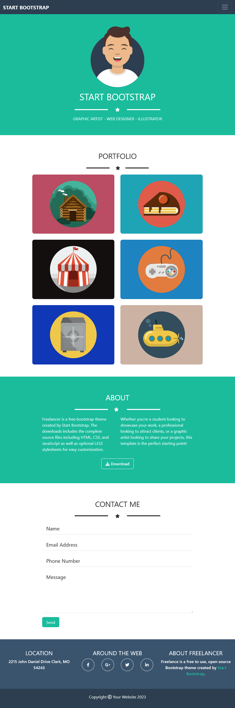

# Boolean - html-css-spotifyweb

This is a solution to the html-css-bootstrap-freelancer challenge of [Boolean](https://boolean.careers/). Boolean help you improve your coding skills by building realistic projects with an increasingly high level of difficulty. 

## Table of contents

- [Overview](#overview)
  - [The challenge](#the-challenge)
  - [Screenshot](#screenshot)
    - [Desktop](#desktop)
    - [Tablet](#tablet)
    - [Mobile](#mobile)
    - [Menu](#menu)
    - [Scrollspy](#scrollspy)
  - [Links](#links)
- [My process](#my-process)
  - [Built with](#built-with)
  - [Useful resources](#useful-resources)
- [Author](#author)

## Overview

### The challenge

Users should be able to:

- View the optimal layout depending on their device's screen size
- See hover states for interactive elements
- Navigate between Home - Search - Rankings pages

### Screenshot

#### Desktop

#### Tablet

#### Mobile

#### Menu

#### Scrollspy

### Links

- Solution URL: [https://github.com/totarochristian/html-css-bootstrap-freelancer](https://github.com/totarochristian/html-css-bootstrap-freelancer)
- Live Site URL: [https://html-css-bootstrap-freelancer-n9xfrfm51-totarochristian.vercel.app](https://html-css-bootstrap-freelancer-n9xfrfm51-totarochristian.vercel.app)

## My process

### Built with

- Semantic HTML5 markup
- CSS custom properties
- Flexbox
- Media Queries
- Bootstrap

### Useful resources

- [Boostrap documentation](https://getbootstrap.com/) - This helped me to learn how to use the Bootstrap framework during the construction of this site.

## Author

- GitHub - [@totarochristian](https://github.com/totarochristian)
- Frontend Mentor - [@totarochristian](https://www.frontendmentor.io/profile/totarochristian)
- Linkedin [Christian Totaro](https://www.linkedin.com/in/christian-totaro-080a7018a/)